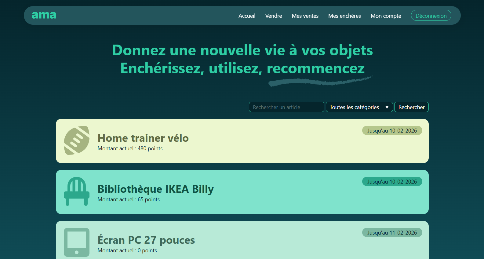
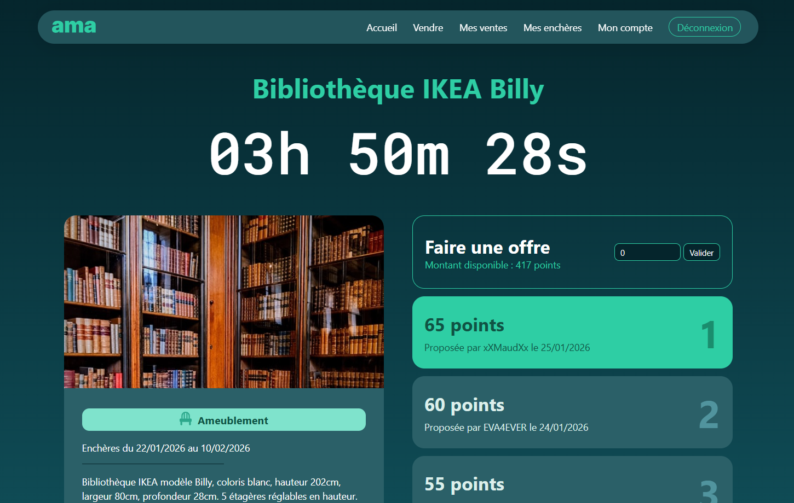
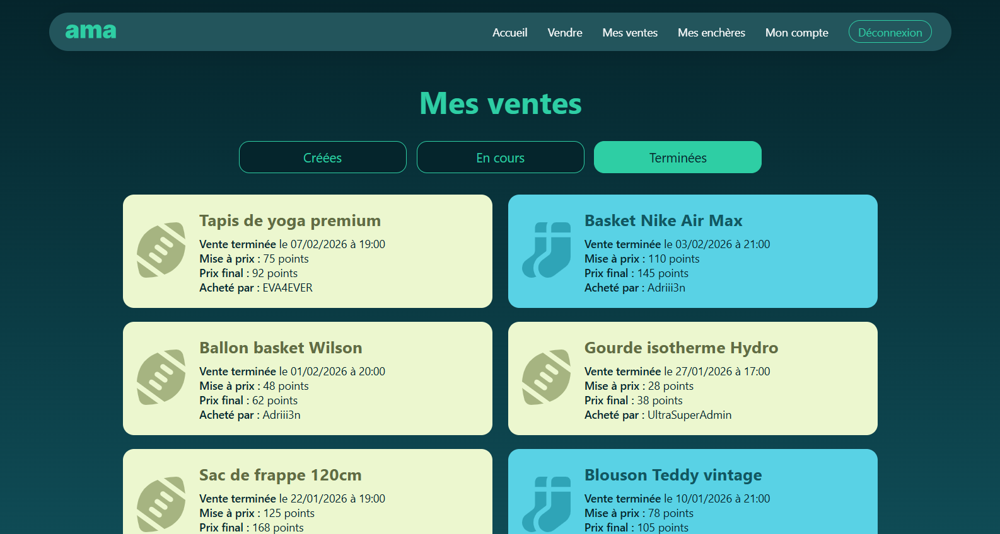
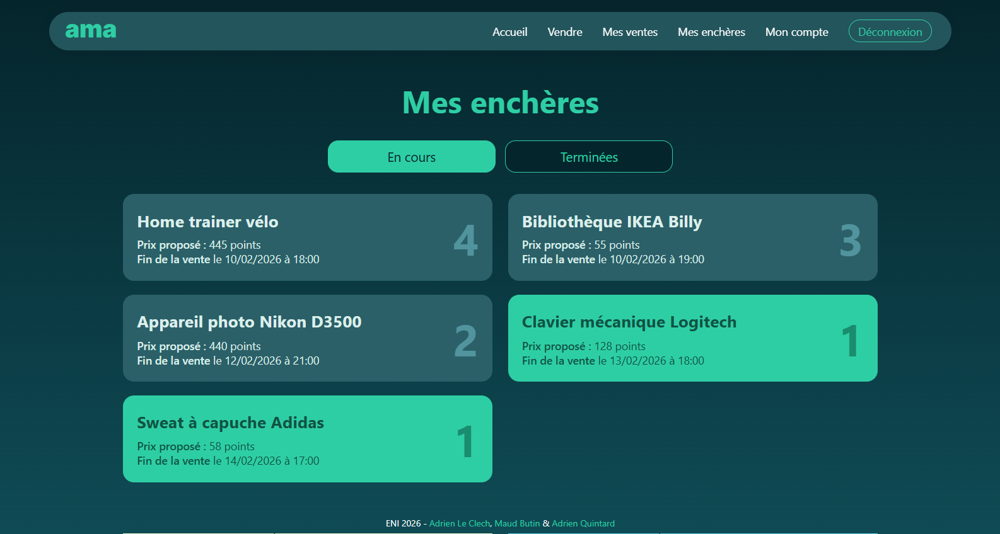

# 🛒 Enchères – Java Spring Boot

Ce projet est une application web d'enchères entre particuliers, développée dans le cadre d'un projet scolaire à l'**ENI École Informatique** (2026).

  

### Fonctionnalités

- **Inscription** et **authentification** des utilisateurs
- Visualisation des **articles disponibles** aux enchères
- **Vente** d'un objet contre des points
- Système **d'enchères en temps réel** en réutilisant ses points acquis
- **Historique des enchères** pour chaque article
- **Tableau de bord** d'un utilisateur avec l'historique de ses ventes et des enchères auxquelles il a participé
- **Gestion du profil utilisateur** (Visualisation de son solde de points, modification et suppression de son profil)

  

  

### Technologies utilisées

- Java 25
- Spring Boot
- Gradle
- Thymeleaf
- HTML / CSS / JavaScript
- SQL Server

  

### Auteurs du projet

**Design et Front** : [mauditbutin](https://github.com/mauditbutin)  
**Back** : [ALC-Tymy](https://github.com/ALC-Tymy), [mauditbutin](https://github.com/mauditbutin), [AdrienQ18](https://github.com/AdrienQ18)

  
### License

Ce projet est sous licence **MIT** — il peut être utilisé, modifié et redistribué.  
Les icônes viennent de [FontAwesome](https://fontawesome.com)  
Les photos d'illustrations des articles pour la démo viennent de [Unsplash](https://unsplash.com/fr)